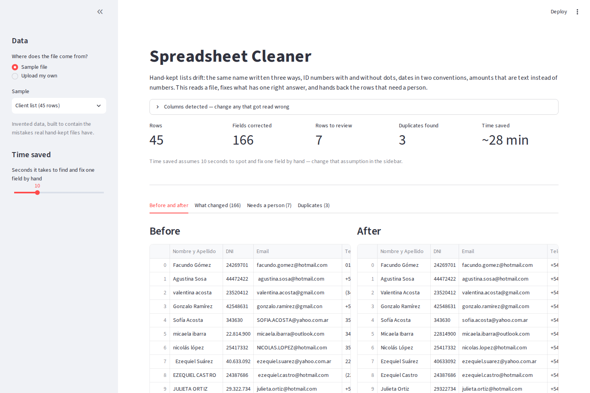
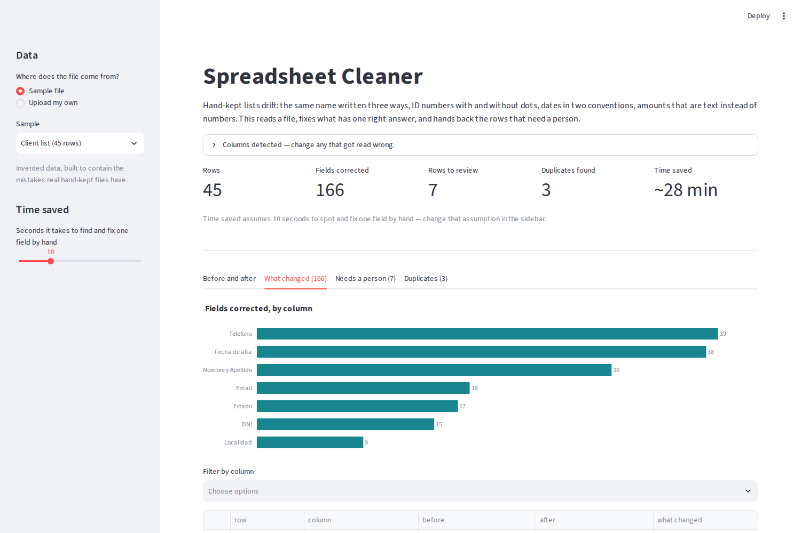

# Spreadsheet Cleaner

Takes a hand-kept client or payments list and returns a clean one, a log of every
change it made, and a short list of the values it refused to guess at.

**Live demo:** https://facundosarina-spreadsheet-cleaner.streamlit.app/

Every list kept by hand drifts in the same ways. The same person is entered as
`JULIETA ORTIZ`, `julieta ortiz` and `  Julieta  Ortiz  `. ID numbers arrive with
dots and without. Half the dates are `17/02/2024` and half are `2024-02-17`.
Amounts are text, so nothing adds up. This tool fixes what has exactly one right
answer and leaves the rest alone.



## What it does

It reads each column, works out what it holds, and applies the matching rules:

| Column kind | What gets fixed |
|---|---|
| Names | trailing and double spaces, ALL CAPS and all lowercase, keeping `de`/`del`/`la` low |
| ID number (DNI) | dots and spaces removed, length checked |
| Tax ID (CUIT) | standard `XX-XXXXXXXX-X` format, **check digit verified** |
| Phone | `011 15 6797-0168`, `(11) 6797-0168`, `0054 9 11…` all become `+54 9 11 67970168` |
| Email | spaces and capitals removed, common domain typos (`gmail.con`) corrected |
| Date | every format converted to `YYYY-MM-DD` |
| Amount | `$ 133.136,27` and `USD 1,234.56` both become real numbers, with the currency split into its own column |
| Category | repeated labels written inconsistently are unified to the spelling used most often |

Duplicates are looked for **after** cleaning, so the same person entered two
different ways still lines up. Nothing is deleted — repeats are listed so a
person decides.

## The part that is actually hard: ambiguous dates

`05/06/2026` is the fifth of June or the sixth of May, and no rule applied to that
value alone can tell you which. The tool does what a person does: it looks at the
rest of the column. If any row has a first number above 12 — `25/06/2026` — then
the column must be day-first, and that settles every ambiguous row around it.
Only when no row in the column is decisive does it fall back to the regional
default. The rule is tested in both directions in `test_cleaner.py`.

## What it refuses to do

A broken CUIT check digit, `31/02/2026`, an address with no `@` — these are
reported, not repaired. Guessing there would quietly corrupt a record, which is
worse than leaving it visible.



Every correction is logged with the row number, the column, the value before, the
value after and the reason. All four outputs download as CSV.

## Running it

```bash
pip install -r requirements.txt
streamlit run app.py
```

Then open http://localhost:8501. Drop in your own CSV or Excel file, or load one
of the two sample files.

```bash
python -m pytest -q       # the cleaning rules, 10 tests
python make_samples.py    # regenerate the sample files
```

## Files

| File | What it is |
|---|---|
| `app.py` | the Streamlit interface |
| `cleaner.py` | the rules — one small function per kind of value, no UI code |
| `pipeline.py` | detects what each column holds and applies the rules to a whole table |
| `test_cleaner.py` | tests for the rules |
| `make_samples.py` | builds the two sample files |
| `data/` | the sample files |

## A note on the data

The two sample files are invented. The names, ID numbers, tax IDs, phone numbers
and amounts were generated by `make_samples.py`; the check digits are real
arithmetic so the validation can be seen working, but they belong to nobody. The
formats and the mistakes are taken from real administrative work — they are the
point of the exercise.
