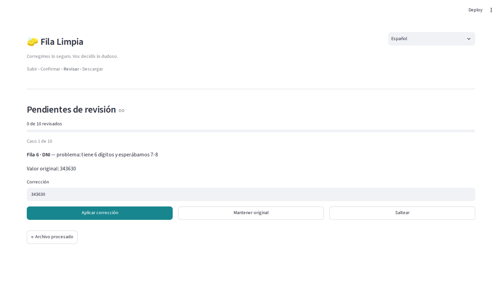
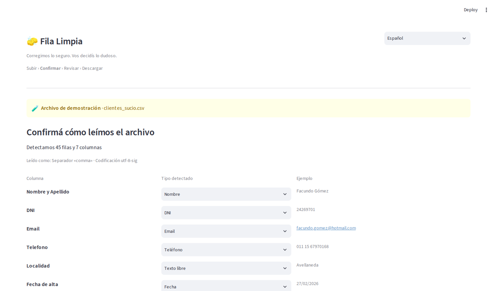

# Fila Limpia

**Corregimos lo seguro. Vos decidís lo dudoso.** — we fix what has exactly one
right answer, and hand back everything else for a person to decide.

Takes a hand-kept client, payment or contact list and returns a clean file, a log
of every change it made, and a review tray for the values it refused to guess at.

**Live demo:** https://facundosarina-spreadsheet-cleaner.streamlit.app/

The interface is available in Spanish, English and Italian. The **rules** are
Argentine — DNI, CUIT, +54 phone numbers, day/month dates, peso amounts — and the
app says so on screen rather than pretending to be generic.



## The problem

Every list kept by hand drifts in the same ways. The same person is entered as
`JULIETA ORTIZ`, `julieta ortiz` and `  Julieta  Ortiz  `. ID numbers arrive with
dots and without. Half the dates are `17/02/2024` and half are `2024-02-17`.
Amounts are text, so nothing adds up. And the file itself is usually a
semicolon-separated Windows-1252 CSV, not the tidy UTF-8 one a tutorial assumes.

## How it works

The app is a sequence, not a dashboard:

**Upload → Confirm → Clean → Review → Download**

1. **Upload.** Drop a CSV, XLSX or XLS. The separator and encoding are detected
   and shown; a workbook with several sheets asks which one to clean.
2. **Confirm.** Every column's detected type is listed with an example value, and
   any wrong guess can be corrected before a single value is touched.
3. **Clean.** Rules run per column:

| Column kind | What gets fixed |
|---|---|
| Name | trailing and double spaces, ALL CAPS and all lowercase, keeping `de`/`del`/`la` low |
| ID number (DNI) | dots and spaces removed, length checked |
| Tax ID (CUIT) | standard `XX-XXXXXXXX-X` format, **check digit verified** |
| Phone | `011 15 6797-0168`, `(11) 6797-0168`, `0054 9 11…` all become `+54 9 11 67970168` |
| Email | spaces and capitals removed, common domain typos (`gmail.con`) corrected |
| Date | every format converted to `YYYY-MM-DD` |
| Amount | `$ 133.136,27` and `USD 1,234.56` both become real numbers, with the currency split into its own column |
| Category | repeated labels written inconsistently are unified to the spelling used most often |

4. **Review.** Everything the rules refused to decide comes back one case at a
   time: the original value, what is wrong with it, an editable field, and three
   choices — apply the correction, keep the original, or skip. Possible duplicates
   are shown side by side with keep-both or delete-the-repeat. Nothing is ever
   deleted behind your back.
5. **Download.** A CSV in, a CSV out; an XLSX in, an XLSX out — with every value
   written as text, so a DNI keeps its leading zeros and a long CUIT does not come
   back as `4.5E+10`. There is also a zip with the clean file, the change log and
   the pending list together.

## The part that is actually hard: ambiguous dates

`05/06/2026` is the fifth of June or the sixth of May, and no rule applied to that
value alone can tell you which. The tool does what a person does: it looks at the
rest of the column. If any row has a first number above 12 — `25/06/2026` — then
the column must be day-first, and that settles every ambiguous row around it. Only
when no row in the column is decisive does it fall back to the regional default.
The rule is tested in both directions in `test_cleaner.py`.

## What it refuses to do

A broken CUIT check digit, `31/02/2026`, an address with no `@` — these are
reported, not repaired. Guessing there would quietly corrupt a record, which is
worse than leaving it visible. That refusal is the product, not a limitation:
everything held back lands in the review tray with a plain-language explanation of
what looked wrong.



## Privacy

Files are processed in memory and are not stored. The cleaning is done by rules
written by hand in `cleaner.py` — nothing is sent to any AI service, and there is
no database behind the app. For genuinely sensitive records, clone the repo and
run it locally; it needs no network access at all.

## Running it

```bash
pip install -r requirements.txt
streamlit run app.py
```

Then open http://localhost:8501.

```bash
python -m pytest -q       # the rules and the file handling, 17 tests
python make_samples.py    # regenerate the two sample files
```

## Files

| File | What it is |
|---|---|
| `app.py` | the interface — which screen, and nothing else |
| `cleaner.py` | the rules — one small function per kind of value, no UI code |
| `pipeline.py` | detects what each column holds and applies the rules to a whole table |
| `fileio.py` | reading CSV/Excel as they really arrive, and writing the results back |
| `i18n.py` | every sentence, in three languages |
| `test_cleaner.py`, `test_fileio.py` | the tests |
| `make_samples.py` | builds the two sample files |
| `data/` | the sample files |

Adding a fourth language is adding one dictionary to `i18n.py`; no other file
contains a user-visible sentence.

## A note on the data

The two sample files are invented. The names, ID numbers, tax IDs, phone numbers
and amounts were generated by `make_samples.py`; the check digits are real
arithmetic so the validation can be seen working, but they belong to nobody. The
formats and the mistakes are taken from real administrative work — they are the
point of the exercise.

## About me

I build automations that take manual, repetitive work — form intake,
document requests, case tracking, spending/data organization — and turn it
into a process that runs itself. Before automation I spent 8+ years running
exactly this kind of process by hand in an administrative/legal setting,
so I know firsthand which parts actually need to be reliable.

Available for freelance automation work — [Workana](https://www.workana.com/freelancer/e77e2133ac2a73aacd51029bb5e7f473) · [LinkedIn](https://www.linkedin.com/in/facundo-sarina/)
